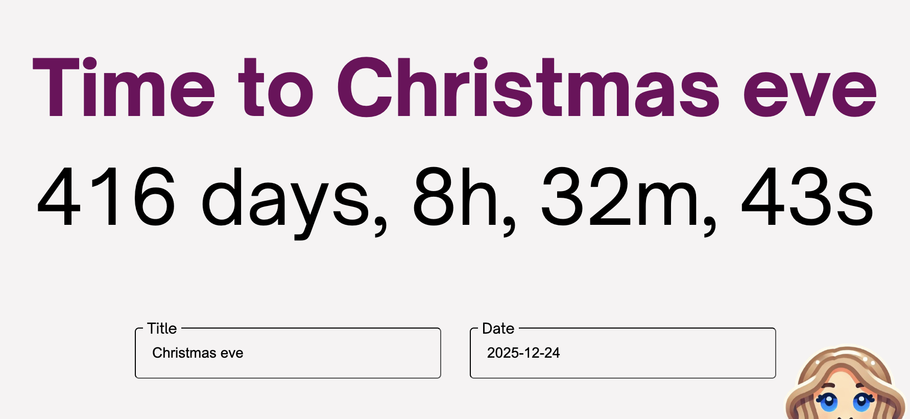

https://responsive-countdown.vercel.app/

# Comments from the developer

This was a super fun assignment with a good mini challenge!

My solution with the while-loop provides the most accurate (and largest) font size for the two
h-tags from the solutions that I've gone though. What I would like to work more on about my solution
is the need for a 1ms timeout; however, that was the only way I could allow time for the font size
to update on the element before checking the new width. I'm also not a fan of the inline styling.

It was also impossible to get the design pixel-perfect without having the Figma dev tool. I did my
best with the data I could gather from the Figma sketch. I understand that design isn't the primary
focus of this assignment, but I just wanted to mention it anyway as this is a frontend role.

I'm excited to hear from you and see your solutions to this problem.

### Suggestions of how this solution can be improved

- Reset button
- Add more validation: to the input fields, number/- only possible in date input
- Saving it to a user, which would require a login or (if this data isnt private) some kind of code
  and identifies the title/countdown
- Sharing it with other users/email addresses
- Share updates/send notifications with the user when the countdown hits certain mile stones. Eg.
  30days, 10days and so on.
- Translations
- I would also add some more testing, both unit testing and the UI/end-to-end(which I thought would
  be a bit of a overkill in this case).

---

# Description & requirements

Your objective in this assignment is to create a countdown app built using this boilerplate (+ any
other tools of your choice) that follows the design specifications provided
[in this Figma file](https://www.figma.com/file/UPEugUz5jM9IzIkWft2Y9m/NC-challenge). The app should
work in portrait as well as in landscape mode while the text displayed on the screen should always
fill the whole width of the screen.

In your app, it should be possible to define the end date and the name of the event taking place on
that day. The countdown should always start from the current time and it should display the time
remaining to your specified end date in the following format: Days, Hours(h), Minutes(m), Seconds(s)
_(e.g., 3 days, 15 h, 20 m, 5 s)_. To make sure the text always covers the entire screen width, it
should resize whenever necessary to achieve this objective.

The purpose of the solution is to “fit” the input text into an element in one line (no line breaks,
filling the whole width) using the maximum possible font-size.

Please make sure that your text fit solution is reusable and that the event name, as well as the
specified end date, are persisted between page reloads.

**Once you feel ready to share your solution, please:**

- Commit the code to Github or your favorite VCS.
- Write a simple README.md explaining how to set up the project (assuming it’s read by a developer
  who is experienced with all the used tools).
- Include a URL to a deployed working Web page (use netlify.com or github.io or whatever simple
  hosting tool that works for you).

Please put the resulting project in a public github repository and provide a link to it. Please make
it easy for us to test the result.

## Optional goals

You’re free to complete this additional goal to get a higher score if you want!

1. Write suggestions of how this solution can be improved. Describe what the next steps would be in
   order for this app to be production ready.

## Running the app

Run `ng serve` for a dev server. Navigate to `http://localhost:4200/`. The application will
automatically reload if you change any of the source files.

## Further help

This project was generated with [Angular CLI](https://github.com/angular/angular-cli) version
17.3.6.

To get more help on the Angular CLI use `ng help` or go check out the
[Angular CLI Overview and Command Reference](https://angular.io/cli) page.
